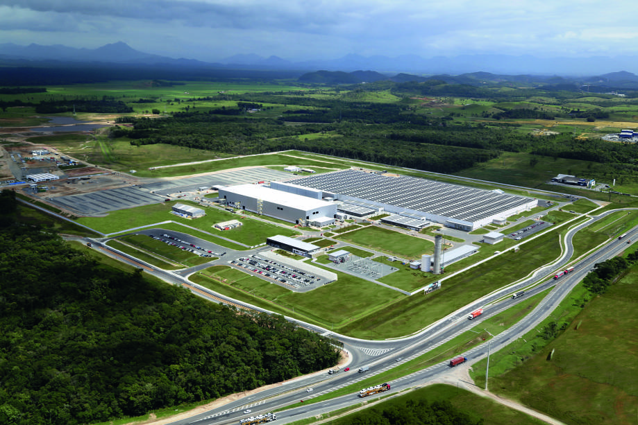
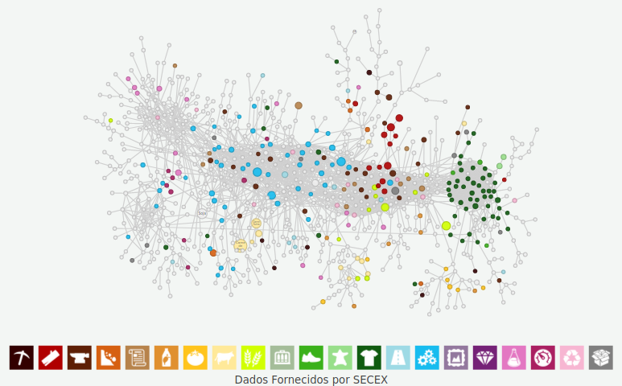

<style>
.html-widget {
    margin: auto;
}
</style>

---

```{r setup, include=FALSE}
library(dplyr)
library(readr)
library(ggplot2)
library(knitr)
library(leaflet)
library(sp)
library(sf)

knitr::opts_chunk$set(echo = FALSE)
```

#### No presente artigo, o autor buscou fazer uma breve análise setorial das duas principais regiões econômicas do estado Catarinense. Para isso, foram obtidos dados das cidades de Florianópolis, São José, Palhoça, Biguaçu, Joinville, Jaraguá do sul, Araquari e São Francisco do sul, conforme ilustra o mapa. Foram analisadas diversas variáveis socioeconomicas, como tamanho da população, área territorial, Produto Interno Bruto, Índice de Desenvolvimento Humano, entre outras. Para mais informações sobre estas cidades, basta passar o hover por cima da cidade de interesse.

```{r test_map, echo=FALSE, fig.width=9, fig.align='center', warning=FALSE, message=FALSE}

sf_file_sc <- sf::read_sf("data-raw/br_unidades_da_federacao/BRUFE250GC_SIR.shp") %>% sf::st_as_sf(.) %>% filter(NM_ESTADO == "SANTA CATARINA")

popupsc <- paste0(
  "<h5><b>Santa Catarina</b></br>",
  "<b>População (2019): <b>7'164'788</br>",
  "<b>Área territorial: 95'730<b></br>", 
  "<b>Habitantes por km^2: </b>65.27</br>",
  "<b>Renda nominal mensal per capta: </b>R$ 1'769</br>",
  "<b>Quantidade absoluta de veículos: </b>5'152'615</br>",
  "<b>Quantidade de veículos por habitante: </b>0.72</br>",
  "<b>IDH: </b> 0.774</br></h5>"
)


scinfo <- data.frame(
  pop19 = 7164788,
  habkm2 = 65.27,
  veiculos = 5152615,
  renda_n_pcm_reais = 1769,
  IDH = 0.774,
  area_territorial_km2 = 95730
)

# sf_file_meso <- sf::read_sf("data-raw/sc_mesorregioes/42MEE250GC_SIR.shp") %>% sf::st_as_sf(.)

# sf_file_micro <- sf::read_sf("data-raw/sc_microrregioes/42MIE250GC_SIR.shp") %>% sf::st_as_sf(.)


sf_file_mn <- sf::read_sf("data-raw/shape_file_ibge/sc_municipios/42MUE250GC_SIR.shp") %>% 
  sf::st_as_sf(.) %>% filter(NM_MUNICIP %in% c("ARAQUARI", "FLORIANÓPOLIS", "PALHOÇA", "SÃO JOSÉ", "JARAGUÁ DO SUL", "JOINVILLE", "SÃO FRANCISCO DO SUL", "BIGUAÇU" ))

popcity <- data.frame(
  muni = c("Florianópolis", "São José", "Jaragua do sul", "Palhoça", "São Francisco do sul", "Joinville", "Biguaçu", "Araquari"),
  CD_GEOCMU = c(4205407, 4216602, 4208906, 4211900, 4216206, 4209102, 4202305, 4201307),
  area_tkm2 = c(675, 150, 529, 395, 493, 1127, 367, 384),
  pop19 = c(500973, 246586, 177697, 171797, 52721, 590466, 68481, 38129),
  IDH = c(0.847, 0.809, 0.803, 0.757, 0.762, 0.809, 0.739, 0.703),
  pib_pc = c(40162, 42262, 49925, 29298, 78766, 47442, 24176, 111317)
) %>% mutate(habpkm2 = round(pop19/area_tkm2, 3), CD_GEOCMU = as.character(CD_GEOCMU))
# popcity

citiessc <- right_join(popcity, sf_file_mn, by = "CD_GEOCMU") %>% sf::st_as_sf(.)

popupcities <- paste0(
  "<h5><b>", citiessc$NM_MUNICIP, "</b></br>",
  "<b>População (2019): <b>", citiessc$pop19, "</br>",
  "<b>Área territorial: ", citiessc$area_tkm2, "<b></br>", 
  "<b>Habitantes por km^2: </b>", citiessc$habpkm2, "</br>",
  "<b>PIB per capita: </b>R$ ", citiessc$pib_pc, "</br>",
  "<b>IDH: </b>", citiessc$IDH, "</br></h5>"
)

normalize <- function(x){
  x <- x[!is.na(x)]
  return((x-min(x))/(max(x)-min(x)))
}
pal <- leaflet::colorNumeric(c("red", "green"), 0:1)

leaflet::leaflet() %>% 
  leaflet::addTiles() %>% 
  leaflet::addPolygons(
    data = sf_file_sc, 
    stroke = T,
    weight = 0.5,
    fillColor = "blue",
    fill = TRUE, 
    fillOpacity = 0.22,
    label = lapply(popupsc, htmltools::HTML)
  ) %>% 
  leaflet::addPolygons(
    data = citiessc,
    stroke = T,
    weight = 0.6,
    fillColor = ~ pal(normalize(citiessc$IDH)),
    fill = TRUE,
    fillOpacity = 0.5,
    label = lapply(popupcities, htmltools::HTML)
  )

```
\

#### Para melhor analisarmos estas informações, confira a seguinte tabela:

\

```{r maptable, echo=FALSE, message=FALSE, warning=FALSE, fig.align='left'}

knitr::kable(popcity, col.names = c("Município", "Código do município", "Área em km2", "População (2019)", "IDH", "PIB per capita", "Habitantes por km2"))

```

\

---

```{r dd1, include=FALSE}

flp <- read_csv("Industrias_em_Florianopolis_2003-2017.csv")

flp_ti <- flp %>% 
  filter(year >= 2010 & year <= 2017) %>% 
  filter(industry_division == "Serviços de Tecnologia da Informação") %>% 
  group_by(year) %>% 
  summarise(
    salario_mediano_flp = median(average_wage),
    total_empregos_flp = sum(jobs)
  )

sj <- read_csv("Industrias_em_Sao_Jose_2003-2017.csv")

sj_ti <- sj %>% 
  filter(year >= 2010 & year <= 2017) %>% 
  filter(industry_division == "Serviços de Tecnologia da Informação") %>% 
  group_by(year) %>% 
  summarise(
    salario_mediano_sj = median(average_wage),
    total_empregos_sj = sum(jobs)
  )

ph <- read_csv("Industrias_em_Palhoca_2003-2017.csv")

ph_ti <- ph %>% 
  filter(year >= 2010 & year <= 2017) %>% 
  filter(industry_division == "Serviços de Tecnologia da Informação") %>% 
  group_by(year) %>% 
  summarise(
    salario_mediano_ph = median(average_wage),
    total_empregos_ph = sum(jobs)
  )

sj <- read_csv("Industrias_em_Sao_Jose_2003-2017.csv")

sj_ti <- sj %>% 
  filter(year >= 2010 & year <= 2017) %>% 
  filter(industry_division == "Serviços de Tecnologia da Informação") %>% 
  group_by(year) %>% 
  summarise(
    salario_mediano_sj = median(average_wage),
    total_empregos_sj = sum(jobs)
  )

bg <- read_csv("Industrias_em_Biguacu_2003-2017.csv")

bg_ti <- bg %>% 
  filter(year >= 2010 & year <= 2017) %>% 
  filter(industry_division == "Serviços de Tecnologia da Informação") %>% 
  group_by(year) %>% 
  summarise(
    salario_mediano_bg = median(average_wage),
    total_empregos_bg = sum(jobs)
  )

emp <- data.frame(
  ano = ph_ti[, "year"],
  total_empregos_flp = flp_ti[, "total_empregos_flp"],
  total_empregos_sj = sj_ti[, "total_empregos_sj"],
  total_empregos_ph = ph_ti[, "total_empregos_ph"],
  total_empregos_bg = bg_ti[, "total_empregos_bg"]
)

tf <- emp %>% filter(year==2017) %>% select("total_empregos_flp")
tsj <- emp %>% filter(year==2017) %>% select("total_empregos_sj")
tph <- emp %>% filter(year==2017) %>% select("total_empregos_ph")

perc_tfsj <- round(tsj/tf, 5)
perc_tfph <- round(tph/tf, 5)

coef_angular <- lm(emp$total_empregos_flp ~ c(1:8))
ca <- round(coef(coef_angular)[[2]])
ss <- summary(coef_angular)
pv_ca <- round(ss$coefficients[8], 3)


```

#### Florianópolis também é conhecida como a Capital da Inovação devido ao polo tecnológico que se concentra, especialmente, na própria cidade. Muitos constumam afirmar que toda a metropole comporta este polo, mas, como podemos observar no dados, São José e Palhoça ainda estão consideravelmente atrás da capital. São José, no ano de 2017, representou apenas `r perc_tfsj * 100`% dos postos de emprego em comparação com a capital e palhoça `r perc_tfph * 100`% em comparação com a mesma.

```{r table1, echo=FALSE, message=FALSE, warning=FALSE, fig.align='left'}

knitr::kable(emp, col.names = c("Ano", "Florinópolis", "São José", "Palhoça", "Biguaçu"))

```

#### Apesar disso, podemos notar que a divisão de Serviços de Tecnologia da Informação tem consigo seguidos avanços em Florianópolis, São José e Palhoça. Apenas a cidade de Biguaçu parece não seguido a mesma tendência de suas vizinhas.

```{r graph2, echo=FALSE, fig.width=12, fig.height=8, message=FALSE, warning=FALSE}

empg <- emp %>%
  rename(
    "Florianópolis" = total_empregos_flp,
    "São José" = total_empregos_sj,
    "Palhoça" = total_empregos_ph,
    "Biguaçu" = total_empregos_bg
  ) %>% 
  tidyr::gather("cidade", "total_de_empregos", 2:5) %>% 
  arrange(year)


ggplot(empg, aes(x = empg$year, y = empg$total_de_empregos, fill=empg$cidade))+
  geom_bar(stat = "identity", position = "dodge")+
  labs(
    title = "Evolução da quantidade de empregos na divisão de Serviços de Tecnologia da Informação entre 2010 e 2017",
    # subtitle = "",
    x = "Tempo",
    y = "Quantidade de empregos formados",
    fill = "Cidade"
  )+
  facet_grid(rows = vars(factor(empg$cidade, levels = c("Biguaçu", "Palhoça", "São José", "Florianópolis"))), scales = "free_y")+
  theme_minimal()+
  theme(legend.position="bottom")


```

#### Se aplicarmos uma regressão linear na série 'número de empregos em Serviços de Tecnologia da Informação na cidade de Florianópolis', chegaríamos a um coeficiente angular de `r ca`. Ou seja, há potencialmente um aumento de `r ca` empregos ao ano. Vale notar que o p-valor do teste t de significância do coeficiente angular é igual a `r pv_ca`, altamente significativo. Claro, outras hipóteses tambem devem ser confirmadas para validarmos o modelo.

---

#### Em 2014, mais ao norte do estado, uma enorme fábrica da montadora de veículos BMW se instalou na cidade. Atualmente a fábrica já não é mais uma novidade para os moradores da pequena cidade de Araquarí, que tem pouco mais de 30'000 habitantes, mas com certeza a mesma exerce forte influência nos indicadres socioeconomicos da cidade. Como podemos observar no gráfico a seguir, o nível de exportação da cidade cresceu vertiginosamente após a chegada da fábrica, especialmente para os estados unidos da américa do norte.

#### De acordo com a revista [Exame](https://exame.abril.com.br/negocios/por-dentro-da-fabrica-da-bmw-em-sc/), "A produção na fábrica do BMW Group em Araquari (SC) segue o princípio 'build-to-stock'. Ou seja, a produção de veículos no local é baseada em dados de vendas e de acordo com o volume de demanda." O investimento realizado na fabrica foi de mais de 600 milhões de reais, resultando em possíveis 1'300 empregos diretos e 2'500 indiretos, quando funcionando em plena capacidade.

```{r exp_araquari, echo=FALSE, fig.width=3, fig.height=2, warning=FALSE, message=FALSE, out.width=c('50%', '50%')}


destino_exportacoes_araquari <- read_csv("destino_exportacoes_araquari.csv")

dea <- destino_exportacoes_araquari %>% 
  filter(year >= 2010) %>% 
  group_by(year, country) %>% 
  summarise(
    valor_exp = sum(value),
    kg_exp = sum(kg)
  )

dea_eua <- dea %>% 
  filter(country == "Estados Unidos")

dea_neua <- dea %>% 
  filter(country != "Estados Unidos") %>% 
  group_by(year) %>% 
  summarise(
    country = "Outros",
    valor_exp = sum(valor_exp),
    kg_exp = sum(kg_exp)
  )

araq_exp <- bind_rows(dea_neua, dea_eua) %>% 
  arrange(year)

ggplot(araq_exp, aes(x = araq_exp$year, y = araq_exp$valor_exp, fill=araq_exp$country))+
  geom_bar(stat="identity")+
  labs(
    title = "Exportações de Araquarí, SC, entre 2010 e 2018",
    # subtitle = "2010 a 2018",
    x = "Tempo",
    y = "R$ exportados em u.m.c",
    fill = "País"
  )+
  theme_minimal()+
  theme(legend.position="bottom",
        text = element_text(size=5))

```

---

#### Por fim, ao analisarmos a distribuição das conexões dos produtos de Santa Catarina com escopo doméstico, percebemos que há considerável disperção entre eles. O estado Catarinenese há anos vem ganhando destaque na produção de aves, carne bovina e suína, produtos texteis, produtos de cerâmica, motores e maquinários diversos.  

### Espaço de Produtos para Santa Catarina (2017)
#### Baseado nos Estados Produtores
#### Exportações: $8,51 Bilhões USD

```{r sc_complex, echo=FALSE, out.width='100%', warning=FALSE}



```

\

---

\

### Referências

#### https://cidades.ibge.gov.br/

#### http://dataviva.info/en/

#### https://ancoraoffices.com.br/por-dentro-da-fabrica-da-bmw-sc/

#### https://exame.abril.com.br/negocios/por-dentro-da-fabrica-da-bmw-em-sc/